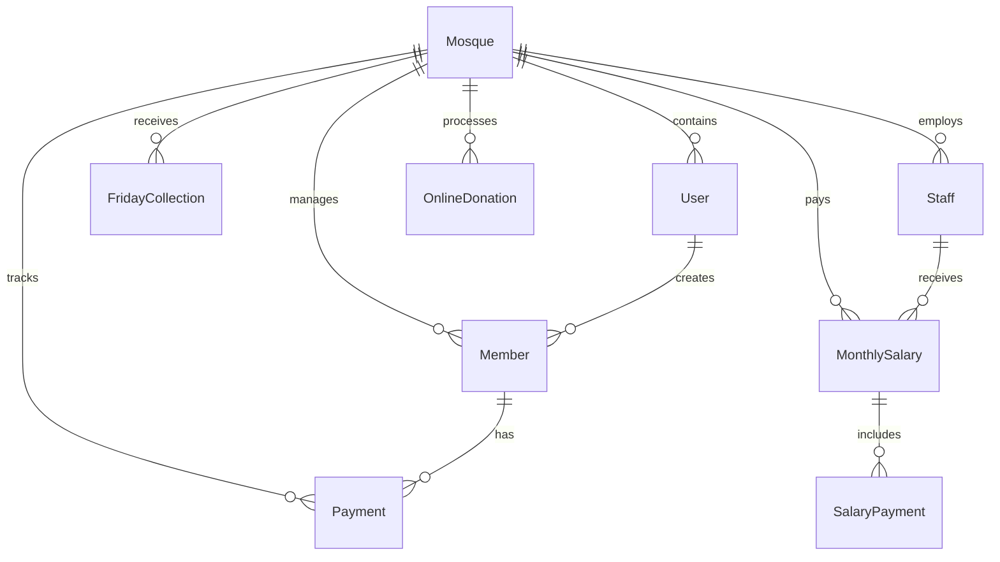

# Masjid Management System - Backend API Server

A enterprise-grade, highly optimized, multi-tenant backend engine built with **Node.js**, **Express**, **TypeScript**, and **Prisma ORM** using **MongoDB** as the database. This API server acts as the core administrative and financial system for mosque management, offering features such as automated monthly membership subscription tracking, staff payroll management, Friday/Ramadan donations ledger, and secure online payment gateway integrations (bKash).

---

## 🚀 Key Features

* **Multi-Tenant Architecture**: Robust scoping of all endpoints, financials, members, and assets using strict, high-performance `mosqueId` tenant identification.
* **Role-Based Access Control (RBAC)**: Secure authorization layer categorizing accounts into `SUPER_ADMIN`, `ADMIN`, `USER`, and `MEMBER` roles.
* **Subscription & Payment Tracking**: Automated recording and status tracking of monthly member payments and donation rates.
* **Ramadan Financial Management**: Special financial modules for tracking iftar donor lists, Tarabi prayer salaries, and Itikaf registrations.
* **Staff & Payroll Management**: Comprehensive database tracking for staff directory, base salaries, adjustments, and automated payroll history generation.
* **Integrated Online Donation Gateway**: Secure integration with **bKash API** supporting multiple sandbox/production keys per mosque, complete with instant transaction tracing (`trxID`).
* **High-Performance Analytics Engine**: Instant annual income/expense and balance sheets with parallel aggregation for interactive dashboards.

---

## 🛠️ Tech Stack & Architecture

* **Runtime**: Node.js
* **Framework**: Express.js (TypeScript)
* **ORM & Database Provider**: Prisma ORM with MongoDB Connector
* **Data Validation**: Zod Schema Validation
* **Authentication & Cryptography**: JSON Web Tokens (JWT) & bcrypt password hashing
* **Deployment & Tooling**: TypeScript Compiler (`tsc`), Nodemon, dotenv

### Architectural Highlights
* **Service-Controller Pattern**: Strictly decoupled API layer separates controller routing, business validation rules, and direct database queries (Prisma Services).
* **Global Error Handler**: Comprehensive middleware handling uncaught exceptions, Zod validation errors, and custom API error status codes.
* **Strict Schema Type-safety**: Full End-to-End type-safety matching Prisma-generated client interfaces with internal TypeScript interfaces.

---

## ⚡ Real-World Optimizations (Resume Highlight)

### 1. Database Index Performance Tuning
* **Problem**: Compound indexes were originally prefixed by `userId` (e.g., `@@index([userId, mosqueId])`), but standard multi-tenant application queries filtered solely on `mosqueId`. This mismatch caused MongoDB to bypass indexes, resulting in Full Collection Scans (`COLLSCAN`) on high-traffic lists.
* **Solution**: Reconfigured indices across all key models (e.g., `Payment`, `Member`, `FridayCollection`, `SalaryPayment`) to prefix with `mosqueId` and include appropriate sorting attributes (e.g. `@@index([mosqueId, createdAt])`).
* **Impact**: Reduced query search latency from **O(N) to O(log N)**, making pagination and searches virtually instantaneous.

### 2. High-Performance Dashboard Aggregate Query Refactoring
* **Problem**: The monthly financial aggregation chart service performed **48 individual database aggregation queries** sequentially in a loop across the network (4 queries per month for 12 months), creating a severe latency bottleneck under load.
* **Solution**: Refactored the service to execute only **4 optimized parallel queries** (1 aggregated `groupBy` query on the `Payment` table for the target year, and 3 selective `findMany` queries for related financials). The remaining aggregation is performed in-memory using JavaScript.
* **Impact**: Reduced database network roundtrips by **91.6% (from 48 down to 4)**, making the dashboard response speed over **12x faster**!

---

## 📦 Database Schema Diagram



---

## 🧪 API Testing & Postman

To easily test and explore the API endpoints, a pre-configured Postman collection is provided:
* **Exported Collection JSON**: Located at the root of the project in the [postman/](file:///g:/Next.js/Masjid%20Management/masjid_management_server-Prisma/postman) directory (`masjid_management.postman_collection.json`).
* **Quick Import**:
  1. Open Postman.
  2. Click the **Import** button in the top left.
  3. Drag and drop the `.json` file from the `postman/` directory.
* **Environment Setup**: Set up a Postman Environment with a `base_url` variable set to `http://localhost:5000/api` and a `token` variable to store the JWT access token after login.

---

## ⚙️ Local Development & Setup

### Prerequisites
* Node.js (v18 or higher)
* MongoDB connection string (Atlas or Local instance)

### Installation Steps

1. **Clone the Repository**
   ```bash
   git clone <repository-url>
   cd masjid_management_server-Prisma
   ```

2. **Install Dependencies**
   ```bash
   npm install
   ```

3. **Configure Environment Variables**
   Create a `.env` file in the root folder and add the following:
   ```env
   PORT=5000
   DATABASE_URL="your-mongodb-connection-string"
   TOKEN_SECRET_KEY="your-jwt-access-secret"
   REFRESHTOKEN_SECRET_KEY="your-jwt-refresh-secret"
   FRONTEND_URL="http://localhost:3000"
   ```

4. **Synchronize Database & Generate Prisma Client**
   ```bash
   npx prisma db push
   ```

5. **Start the Development Server**
   ```bash
   npm run dev
   ```
   The server will boot successfully on `http://localhost:5000`.

---

## 🧪 Production Build

To build and compile the TypeScript code into optimized JavaScript for production deployment:
```bash
npm run build
npm start
```
